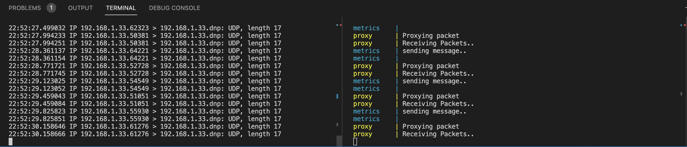

# Kasa Smart Plug Power Use 
This project was created as a first step in building out a self built smart home system using both off the shelf products and arduino boards 

Smart Plugs must be configured with Kasa smartphone application, this is a one and done task. 

This system must be ran on the same network plane as the devices(s), meaning the broadcast IP for plug must be the same as broadcast IP as host running deployment. If devices are reachable, project will find devices and begin collecting and proxying data to a (currently) non-existent frontend. 

### Requirements
- Unix based OS 
- Python 3.9+ 
- PIP3
- Docker 
- Docker Compose
- Protobuf 
- TP-Link Kasa Smart Plug 

### Steps
1. Clone repo 
2. Change values in deployment/example.env 
3. Rename example.env to .env 
4. Run start.sh 

### TO-DO
- Create frontend 
- Implement checking timing of messages to create hourly reports 
- Implement daily power limits 
- Migrate to k3s

Note: This project was written in less than a day to provide sample code for job interview. Please keep that in mind when viewing!

